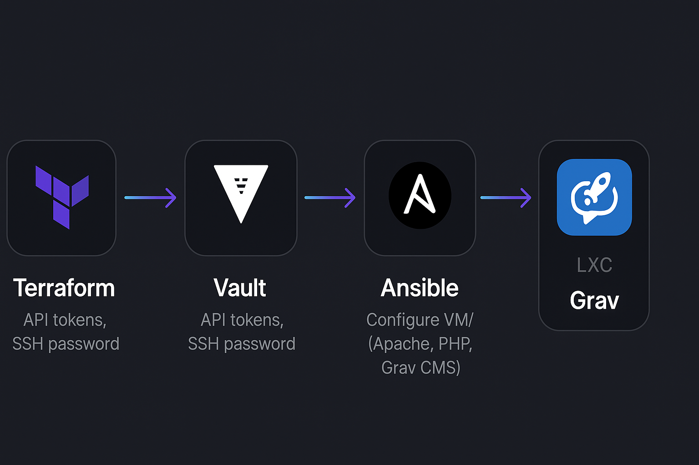

# Projeto: Provisionamento do Grav CMS com Terraform + Ansible

<p align="center">
  
  
  
  
</p>

---

## 📌 Descrição do Projeto

Este projeto automatiza o provisionamento de uma VM no Proxmox com o CMS **Grav** instalado, utilizando **Terraform** para criar a infraestrutura e **Ansible** para a configuração da aplicação.

Além disso, as variáveis sensíveis são armazenadas e gerenciadas de forma segura utilizando o **HashiCorp Vault**.

---

# 🏗️ Arquitetura / Fluxo do Projeto

Abaixo, uma visão geral moderna do fluxo do projeto, desde o provisionamento até a configuração do Grav CMS com Vault e Ansible:

<p align="center">
  
</p>

## 🧩 Estrutura do Projeto

```
├── main.tf
├── variables.tf
├── terraform.tfvars
├── secrets.auto.tfvars
├── ansible
│   ├── ansible.cfg
│   ├── group_vars
│   │   └── all.yml
│   ├── inventory.ini
│   ├── playbook.yml
│   └── roles
│       ├── apache_php
│       │   ├── tasks
│       │   │   └── main.yml
│       │   └── templates
│       │       └── docker-compose.yml.j2
│       └── grav
│           ├── tasks
│           │   └── main.yml
│           └── handlers
│               └── main.yml
├── scripts
│   └── run_ansible.sh
├── terraform.tfstate
├── terraform.tfstate.backup
└── VM-Grav.7z
```

---

## 🔒 Vault

- Utilizado para armazenar e disponibilizar variáveis sensíveis como:
  - `ansible_password`
  - `pm_api_token_secret`
  - `pm_api_token_id`
  - `pm_api_url`

- As variáveis são recuperadas dinamicamente no Terraform e passadas ao Ansible.

**Importante:** Para utilizar o Ansible corretamente é necessário exportar o token do Vault no momento da execução do playbook:

```bash
VAULT_TOKEN="seu_token" ansible-playbook -i ansible/inventory.ini ansible/playbook.yml
```

---

## 🌐 Para que serve o Grav

**Grav** é um CMS (Content Management System) flat-file moderno que não utiliza banco de dados. Ele é conhecido pela sua leveza, velocidade e facilidade de manutenção. Ideal para blogs, portfólios e sites institucionais.

---

## 📝 Passos para Executar

1. **Iniciar Terraform**

```bash
terraform init
terraform apply
```

2. **Executar o Ansible manualmente (se necessário)**

```bash
VAULT_TOKEN="seu_token" ansible-playbook -i ansible/inventory.ini ansible/playbook.yml
```

3. **Acessar o Grav**

Abra o navegador e acesse o IP da VM provisionada.

---

## ⚡ Dica importante

Para que a senha do Vault seja injetada corretamente no ambiente:

```bash
export VAULT_TOKEN="seu_token"
```

Além disso, se usar Bash ou ZSH, cuidado com caracteres especiais como **!** que precisam ser escapados.

---

## ✅ Status final

- Proxmox cria a VM ✅
- Ansible instala Apache e PHP ✅
- Ansible baixa e instala Grav ✅
- Apache com mod_rewrite e AllowOverride configurados ✅
- Variáveis sensíveis usando Vault ✅

---

## 📚 Créditos

Automação e provisionamento: Terraform + Ansible + Vault  
Aplicação: Grav CMS
